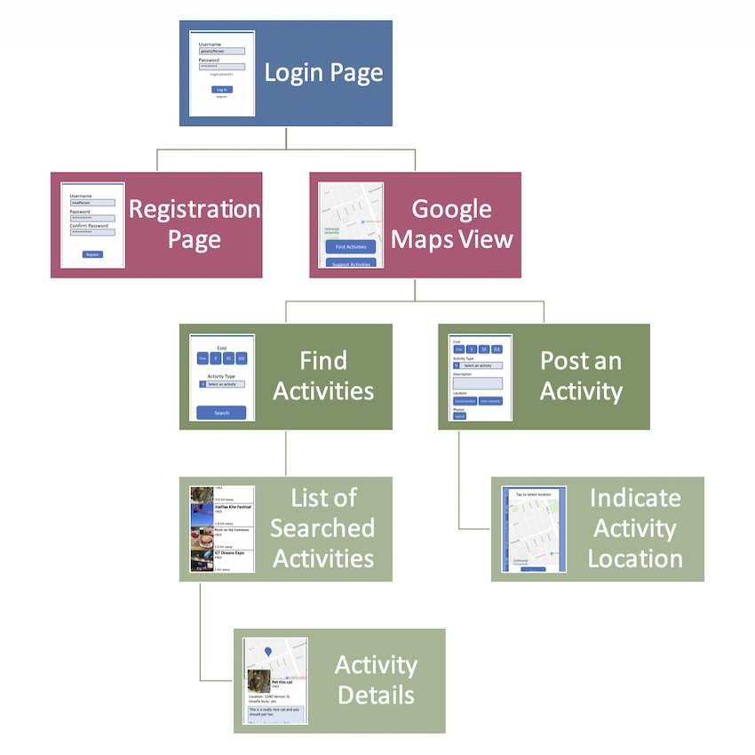
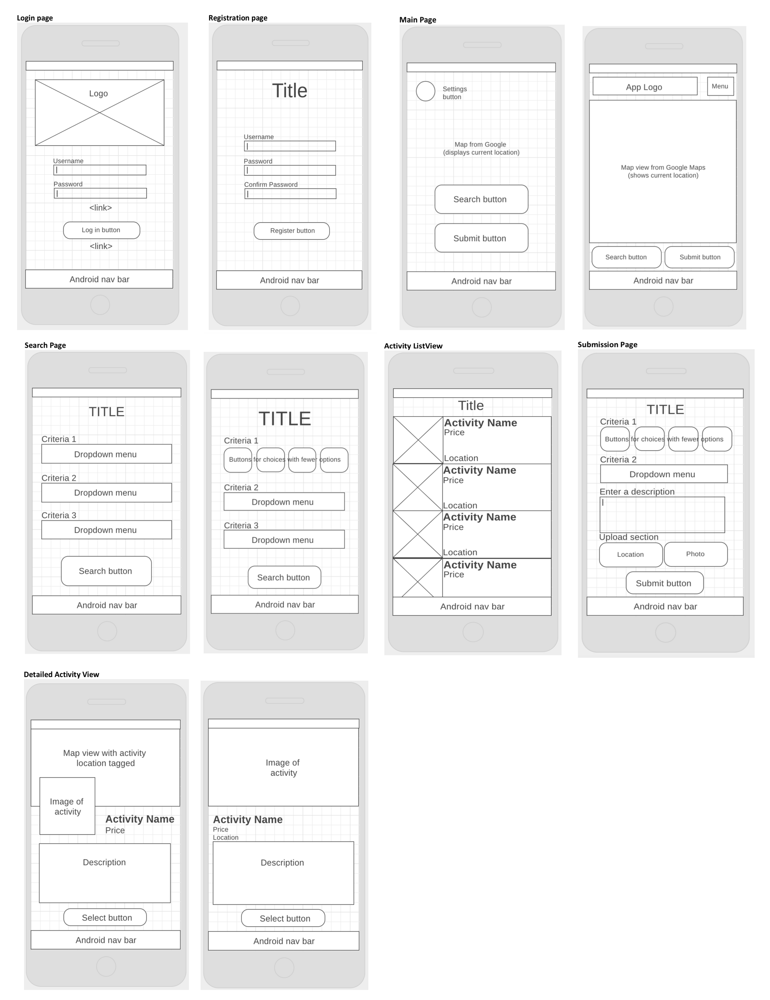
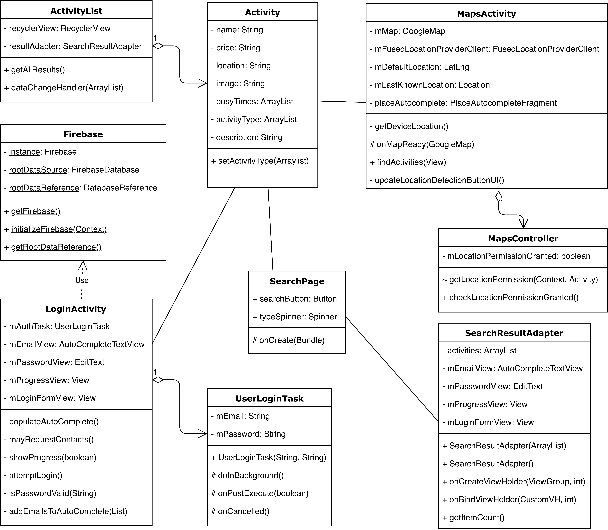

# Repository Overview and Purpose
This is the original version of "AdventurUs: A Boredom Solving App", which was a group project submitted to Dalhousie University as part of our coursework for CSCI 4176: Mobile Computing in the Fall 2018 semester. The original contributors to this project are listed below, under the "Group members" subheading.

As a contributor to the project, I decided to upload the final submission to my personal GitHub account, so that potential employers and/or colleagues may look at one of the sizable projects I contributed to during my time in school. Aside from changes to this ReadMe file, all files in the repository have not been altered since the original submission at the end of the Fall 2018 semester. If I decide to continue working on the project in the future, any changes would be made under a separate repository on my GitHub account.

The remaining sections of the ReadMe were part of the project submission, with only personal/contact information removed.

# Identification

Our project is called *AdventurUS*.

__Group members__:
- Marlee Donnelly
- Matthew Reid
- Karan Sukhija
- Aman Arya
- Neharika Sehgal

# Project Summary
AdventurUS is an app designed to help people between the ages of 20-30 beat boredom by generating a customized list of activities close to wherever they happen to be. Since the activity suggestions are provided by other users, a large community and variety of options is required to generate lists that are actually fitting and helpful, so this app is intended to be used in more heavily populated areas, like cities. 

AdventurUS is a location-based app, so its main page is a map view centered on the user's GPS location. If they wish, the user can also use the search bar on this page to tailor their results to a different location of their choice. If any activities happen to be nearby, they will appear on the map as pins. From the map page, users can then complete two different tasks: the first, "suggest an activity," allows users to add their own activity ideas to the database using a simple form, making their suggestion visible to other users. The second, "find an activity," presents the user with an equally simple search page, which presents the user with a grid view of customized activity ideas when submitted. When the user selects an item in the grid, they will be presented with detailed information about the activity it relates to, as well as any relevant weather warnings if the activity takes place outdoors.

## Libraries

__Picasso:__ Since we retrieve photos from an online repository we created, this project uses the Picasso library to translate those image URLs into image resources that our app can then display. It can be found here: http://square.github.io/picasso/

## Installation Notes
No special steps are required to install this app; simply clone the project from our repository, open it in Android Studio, and run it. 

However, once the app is running, please consent to sharing your location when prompted so that all app features will be visible and useable. If you are not using a phone, the default location for an Android emulator is Google's headquarters in California, so in order to see the activities that we created (located in Halifax), you will need to enter a Halifax address or street name into the search bar to re-locate yourself. If you prefer, you can also change the emulator's default GPS location using some local coordinates (a latitude of 44.647371 and longitude of -63.580555 puts you right on top of Citadel Hill). If you do not change your location, the app will calculate that you are approximately 4000 km away from all of the activities we created and filter them out of your search results due to the excessive distance.

## Code Examples
__Problem 1: Sharing commonly used methods and values amongst different activity pages__

Since this app focuses so much on location, we found that we required certain methods and pieces of information quite frequently: translating written place names into coordinates for our map, finding the user's current location based on the GPS, setting the default map zoom level, checking for a network connection, and calculating the distance between two geographical points. In order to share this information and avoid copying nearly identical functions over and over again, we created a Utility singleton class that can be called from anywhere.
```
// Our Utilities class and one of its methods (other methods not included due to length)

public class Utilities {

    private static final int DEFAULT_ZOOM = 15;
    private static Utilities utilSingleton = null;
    private LatLng searchLocation = null;

    //Singleton - only instantiate once
    private Utilities(){

    }

    public static Utilities getInstance()
    {
        if (utilSingleton == null)
        utilSingleton = new Utilities();

        return utilSingleton;
    }

    public LatLng getCoordinates(Context context, String addrStr) {
        List<Address> addrList;
        Geocoder gc = new Geocoder(context);
        LatLng coordinates = null;

        try{
            addrList = gc.getFromLocationName(addrStr, 4);
            Address address = addrList.get(0);
            coordinates = new LatLng(address.getLatitude(), address.getLongitude());
        }
        catch (IOException e){
            e.printStackTrace();
        }

        return coordinates;
    }
// Not shown: getDefaultZoom, getSearchLocation, setSearchLocation, calculateDistanceFromMe

// Here is an example of one of Utilities' methods being called from DetailedViewActivity.java:
activityLocation = util.getCoordinates(this, activity.getLocation());
```

__Problem 2: Keeping Track of Device Connectivity to a Network__

Our app is largely dependant on maintaining an active connection to the internet, since there is a major emphasis on back-end work. As a result, it became clear to us that we needed to incorporate a way for the app to track the status of the device's connection to the internet, and to block interactions requiring a network connection when there isn't one present.

To do this, we utilized the Utilities class shown above, adding a method to check what the status is of the connection. This returns a boolean, which we use in several other Java classes to check for internet connectivity before performing important back-end work, such as logging in, registration, performing searching on the database, etc.
```
//From Utilities.java:

/*Check if the device is currently connected to a network.
We were not sure how to do this, so we referred to the Android developer documentation:
https://developer.android.com/training/monitoring-device-state/connectivity-monitoring
*/

public boolean checkConnection(Context context) {
    ConnectivityManager cm =
    (ConnectivityManager)context.getSystemService(Context.CONNECTIVITY_SERVICE);

    NetworkInfo activeNetwork = cm.getActiveNetworkInfo();
    boolean isConnected = activeNetwork != null &&
    activeNetwork.isConnectedOrConnecting();

    return isConnected;
}


//Example of usage from Login.java, before performing a Login attempt:

private void attemptLogin() {

    if (util.checkConnection(getApplicationContext()) == false)
    {
        Toast.makeText(thisActivity, "Error: No network connection detected. Check network connectivity and try again.", Toast.LENGTH_SHORT).show();
        return;
    }

```


## Feature Section
##### User Registration
If the user does not already have an AdventurUS account, they can tap the "Register" button on the login page in order to be brought to the registration form. This page prompts the user to select a username and password, then enter an email address to associate with the account. It performs checks to ensure that these fields are filled out and do not conflict with users already added to the authentication database, then stores the user's account information.

##### Login and Logout
Users must have an account to contribute or search for activity ideas, so the email and password provided when they registered can be entered on the login page and checked against our authentication database. Once they gain access, logging out is simply achieved by navigating back to the login page, although the user must confirm their decision to do so after being prompted by an alert. This prevents users from logging out accidentally.

##### Main Map
The main map displays the user's current location, as determined by the GPS, as a small blue dot, showing them the area immediately around where they are located. If any of the database's activity suggestions fall within this range, they will appear as orange map markers that display the name of the activity they represent when clicked. The user can also manually scroll around the area to check for other markers, or enter a location in the top search bar to see any suggestions located near the area they specify. Since users are allowed to scroll around to look at surroundings beyond their original view, the main map also includes a button to re-centre the view on the user's location.

##### Submit an Activity
When the user chooses this option, they are brought to a blank form that asks for the price of the activity they are suggesting, a name for it, and a description. The user's current location gets stored as the location of the suggested activity. The user can also upload an image of their activity by either selecting a photo from their phone's stored gallery of photos, or taking a photo with the camera directly. Once the form is complete, its contents are verified and then added to our database.

##### Search for an Activity
When the user chooses this option, they are brought to a form similar to the one used in the submission feature. This one simply provides four buttons specifying the different price ranges available (from "free" to "$$$," symbolizing "expensive"), as well as an "any" button in case the user isn't fussy about the price of the activity they do. The user can then select the type of activity they want to search for and the maximum distance they wish to travel from dropdowns before submitting their choices. Once submitted, a grid view of activities matching their search criteria is displayed, and they can tap on an item from the grid to get more detailed information about the activity they are interested in.

##### Weather Warnings
If the user selects an activity from the search results grid that is classified as an "outdoor" activity, the app sends a request to the OpenWeatherMap API using that activity's coordinates. If the API indicates that the weather is less than stellar, the detail page for that activity will display a warning in red text underneath the usual activity description. This ranges from general advice to dress appropriately for weather like snow or rain, or to expect poor visibility in case of fog, to advice to stay indoors in response to extreme weather events such as poor air quality, thunderstorms, and volcanic activity.

## Final Project Status
Unfortunately, not all of the planned project functionality was able to be implemented within the given time frame. The features for social media integration, providing business information from Google, and tracking peak hours were deemed unnecessary as we got further into user testing and our vision for the product evolved; they were simply not necessary for users of the app to have a satisfying experience, and would have taken more time to incorporate than was practical. The submission page was also altered due to time constraints, and now uses either the user's current location or the location they last searched for on the maps screen instead of prompting them to enter a location themselves. This could potentially be confusing for users, since they have no way of knowing that this is happening behind the scenes, but was faster and easier to implement. Originally, a popup was supposed to appear, allowing users to set the location of the activity by tapping it on the map, but this approach was dropped due to certain group members experiencing a more significant workload than they expected and prioritizing other things.

If we were to continue developing this application in the future, we would want to finish up the submissions activity so that it matched the level of functionality and polish originally planned for it, adding more detailed location selection features and replacing the slider with buttons to match the search page. Another very useful feature that we would have liked to incorporate was the ability to provide users with step-by-step directions from their location to their chosen activity, but using Google's API for this functionality requires setting up a billing account, so we would have to either find an alternative resource or a means of paying for the service. If we were really going to launch this app, we would likely use some of our advertising revenue for this.

#### Minimum Functionality
- User registration (Completed)
- Login and logout functionality (Completed)
- Submission page (Completed)
- Search page (Completed)
- Google Maps integration (Completed)

#### Expected Functionality
- Filter search results by distance from the user (Completed)
- Filter search results by budget and type of activity (Completed)
- Allow users to add photos from the camera to their activity submissions (Completed)
- Allow users to indicate how busy the activity location was when they arrived (Not Implemented)

#### Bonus Functionality
- Provide business information, including reviews and hours of operation, from Google (Not Implemented)
- Track weather and display weather warnings for outdoor activities (Completed)
- Social media integration (Not Implemented)

## Sources

### Images and Fonts
##### Background Image
"Aerial drone shot of silhouettes of people hiking in mountains in Bali. Camera flying towards scenic sunset over horizon Stock Video Footage - Storyblocks Video." Pressmaster Production Studio. (n.d.). [Online]. Available: https://www.videoblocks.com/video/aerial-drone-shot-of-silhouettes-of-people-hiking-in-mountains-in-bali-camera-flying-towards-scenic-sunset-over-horizon-hr05rsqzzj3b9qxi8

##### Logo
"Riffic Font." InkyType. (n.d.). [Online]. Available: https://www.dafont.com/riffic.font?psize=l&text=AdventurUS

"Map Marker Clipart." teddy. (2015, September 24). [Online]. Available: http://worldartsme.com/map-marker-clipart.html#

##### Image Placeholder (Submit Page)
"Our Recent Project." iSplendid. (2018). [Online]. Available: http://www.i-splendid.com/android/

##### Sample Activity Photos
"Centennial." Art Gallery of Nova Scotia. (2008). [Online]. Available: https://www.artgalleryofnovascotia.ca/exhibitions/centennial

"How public libraries are reinventing themselves for the 21st century." Bethune, B. (2018, January 25). [Online]. Available: https://www.macleans.ca/society/how-public-libraries-are-reinventing-themselves-for-the-21st-century/

"A Halifax Transit ferry." Groff, M. (2018, February 15). [Online]. Available: https://www.halifaxtoday.ca/local-news/more-frequent-alderney-ferry-crossings-start-tuesday-840352

"POINT PLEASANT PARK." Hello Halifax. (n.d.). [Online]. Available: http://www.hellohalifax.ca/hiking/pointpleasant.php

"Our Agave has been planted and is enjoying the beautiful weather. Visit the Halifax Public Gardens today! " Hfxgov. (2018, April 27). [Online]. Available: https://twitter.com/hfxgov/status/989903346097061889

InspiRock. (n.d.). Trapped, Halifax. Retrieved October 16, 2018, from https://www.inspirock.com/canada/halifax/trapped-a2393639455

"Tender bbs eating this delish meal!" The Loaded Ladle. (2018, March 13). [Online]. Available: https://www.instagram.com/p/BgRSWDQh5QU/

"Projects- IKEA Halifax." MatrixAir. (2017).  [Online]. Available: http://www.matrixairheating.com/matrixair-ikea-halifax.html

"A bright future for campus health and wellness: Inside the new Dalplex fitness centre." McNutt, R. (2018, May 25). [Online]. Available: https://www.dal.ca/news/2018/05/25/a-bright-future-for-campus-health-and-wellness--inside-the-new-d.html

"'Unprecedented demand' : Mamma Mia! gets second extension at Neptune Theatre." Metz, S. (2018, May 10). [Online]. Available: https://www.halifaxtoday.ca/local-news/unprecedented-demand-mamma-mia-gets-second-extension-at-neptune-theatre-920635

"Natural History Museum, Halifax, Nova Scotia." Nova Scotia Travel Guide. (n.d.). [Online]. Available: http://nstravelguide.com/go/halifax/sights/naturalhistorymuseum

"The Bicycle Thief." Yelp. (n.d.). [Online]. Available: https://www.yelp.com/biz/the-bicycle-thief-halifax?hrid=NE4t3wkiwx7iGWNX0WZsIA&rh_ident=main&rh_type=phrase

"The Board Room Game Cafe - CLOSED - Bedford - Halifax, NS." Yelp. (2017, October 23). [Online]. Available: https://www.yelp.ca/biz/the-board-room-game-cafe-halifax-2


##### Research Material and Reference Guides
"Material Design." Google. (2018). [Online]. Available: https://material.io/

"Weather Icons." OpenWeatherMap. (n.d.). [Online]. Available: https://openweathermap.org/weather-conditions

"Determine and Monitor the Connectivity Status." Google Developers. (2018, May 8). [Online]. Available: https://developer.android.com/training/monitoring-device-state/connectivity-monitoring

## Planning Documents
#### Sitemap

#### Wireframes
Note that not all wireframes displayed are used; we selected our favourite layouts out of these options prior to implementing them.


#### Class Diagram

